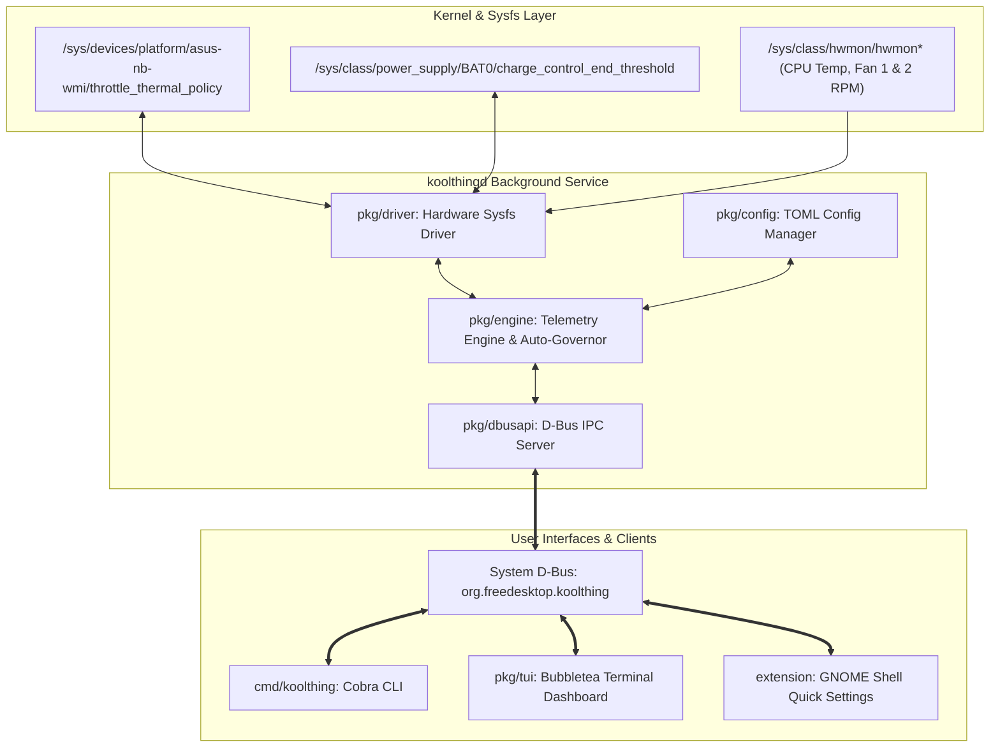

# ❄️ KoolThing

[](https://golang.org)
[](https://extensions.gnome.org)
[](https://www.freedesktop.org/wiki/Software/dbus/)
[](LICENSE)
[]()

> **High-Performance ASUS VivoBook & ZenBook Thermal, Dynamic Fan Curve, and Battery Care Management Suite for Linux.**

KoolThing is a lightweight, zero-bloat system utility tailored specifically for ASUS laptops running Linux. Written entirely in pure Go with a companion GNOME Shell 45+ Quick Settings extension, KoolThing gives you seamless control over ASUS hardware thermal profiles, dual-fan RPM monitoring, automated thermal curve hysteresis, and hardware battery charge health limiting (60% / 80% / 100%).

---

## 📑 Table of Contents

- [Key Features](#-key-features)
- [Architecture Overview](#-architecture-overview)
- [Supported Hardware & Models](#-supported-hardware--models)
- [Quick Start & Installation](#-quick-start--installation)
  - [Prerequisites](#prerequisites)
  - [Build and Install Suite](#build-and-install-suite)
  - [Install GNOME Shell Extension](#install-gnome-shell-extension)
- [CLI Reference](#-cli-reference)
- [Interactive TUI Dashboard](#-interactive-tui-dashboard)
- [GNOME Shell Quick Settings Extension](#-gnome-shell-quick-settings-extension)
- [Configuration Reference](#-configuration-reference)
- [D-Bus IPC API Specification](#-d-bus-ipc-api-specification)
- [Troubleshooting & Diagnostics](#-troubleshooting--diagnostics)
- [Contributing & Hacktoberfest](#-contributing--hacktoberfest)
- [License](#-license)

---

## ✨ Key Features

- 🚀 **Hardware Thermal Profiles**: Instant switching between ASUS hardware modes (`Silent`, `Standard`, `Boost`) via `asus-nb-wmi` sysfs and Linux ACPI platform profiles.
- 🔋 **ASUS Battery Care Health Limiter**: Protect lithium-ion health by locking battery charge threshold to **60%**, **80%**, or **100%** (`charge_control_end_threshold`).
- 🧠 **Dynamic Auto-Governor**: Intelligent hysteresis thermal governor that steps thermal profiles up under sustained load and safely steps them down when cool, eliminating noisy fan hunting.
- 📊 **Real-time Dual Fan & CPU Telemetry**: Non-blocking asynchronous sampling of CPU package temperature and primary/secondary fan RPMs via Linux `hwmon`.
- 💻 **Interactive Bubbletea TUI**: Gorgeous terminal dashboard with real-time ASCII telemetry gauges, battery status bars, and responsive single-key controls.
- 🧩 **GNOME Shell 45+ Quick Settings**: Native GNOME top-bar integration with live telemetry subtitle, symbolic icons, and quick-toggle menu cards.
- 🔒 **Security-Hardened D-Bus IPC**: Centralized `koolthingd` daemon running over `org.freedesktop.koolthing` system bus with polkit/D-Bus security policies allowing unprivileged desktop clients.
- 🧪 **100% Mockable & Tested**: Zero required external C dependencies with fully mockable sysfs layers for deterministic unit and race testing.

---

## 🏛️ Architecture Overview



---

## 💻 Supported Hardware & Models

KoolThing supports ASUS laptops featuring the `asus_nb_wmi` or `asus_wmi` kernel module, as well as laptops supporting Linux ACPI platform profiles:

- **ASUS VivoBook Series**:
  - VivoBook S14 / S15 / S16 (K5404, S5404, M5402, M5502, S533, etc.)
  - VivoBook Pro 14 / 15 / 16 OLED (K3400, K3500, K3502, K6502, N7600)
  - VivoBook Go 14 / 15, Flip 14
  - VivoBook 15 / 17 (X512, X515, M515, X712)
- **ASUS ZenBook Series**:
  - ZenBook 13 / 14 / 15 / Flip / Duo (UX325, UX425, UX434, UX482, UM425, etc.)
  - ZenBook Pro 14 / 16 OLED
- **ASUS ROG & TUF Series** (Thermal mode & battery limiter compatibility):
  - ROG Zephyrus G14, G15, G16, M16
  - ASUS TUF Gaming A15, A16, F15, F17
  - ROG Flow X13, Z13, X16

> **Kernel Requirement**: Linux 5.15+ (Linux 6.2+ recommended for complete multi-fan hwmon support).

---

## 🚀 Quick Start & Installation

### Prerequisites

Ensure you have the standard build toolchain installed on your Linux distribution:

- **Go**: Version 1.22 or higher
- **Make**: Standard GNU Make
- **D-Bus & systemd**: Standard on Fedora, Ubuntu, Debian, Arch Linux, openSUSE, etc.
- **Node.js** *(optional, for running extension tests)*

#### Fedora / RHEL
```bash
sudo dnf install golang make dbus-devel
```

#### Ubuntu / Debian
```bash
sudo apt update && sudo apt install -y golang make dbus
```

#### Arch Linux
```bash
sudo pacman -S go make
```

---

### Build and Install Suite

```bash
# 1. Clone the repository
git clone https://github.com/asus-linux/koolthing.git
cd koolthing

# 2. Compile both binaries (CLI & Daemon)
make build

# 3. Install daemon, CLI, systemd service, and D-Bus policy (requires root)
sudo make install

# 4. Reload systemd & D-Bus, then enable the daemon
sudo systemctl daemon-reload
sudo systemctl reload dbus
sudo systemctl enable --now koolthing.service
```

Verify the daemon is running properly:
```bash
systemctl status koolthing.service
koolthing status
```

---

### Install GNOME Shell Extension

To install the KoolThing Quick Settings menu for GNOME 45, 46, 47, 48+:

```bash
# Install extension to ~/.local/share/gnome-shell/extensions/
make install-extension

# If running Wayland, log out and log back in, or enable directly:
gnome-extensions enable koolthing@asus-linux.org
```

---

## 🕹️ CLI Reference

The `koolthing` CLI provides full control over hardware profiles, battery thresholds, governor settings, and telemetry output.

### 1. Show System Status

```bash
# Human-readable dashboard summary
koolthing status

# Machine-readable JSON output (ideal for scripts, Waybar, Polybar, Conky)
koolthing status --json
```

**JSON Output Example:**
```json
{
  "cpu_temp": 52.4,
  "fan1_rpm": 2400,
  "fan2_rpm": 0,
  "battery_percent": 79,
  "battery_limit": 80,
  "on_ac": true,
  "active_mode": "standard",
  "auto_mode": false
}
```

### 2. Thermal Profile Switching

```bash
# View active profile
koolthing mode

# Set thermal mode: silent (whisper quiet), standard (balanced), boost (max cooling)
koolthing mode silent
koolthing mode standard
koolthing mode boost
```

### 3. Battery Health Care Limit

```bash
# View active charge limit
koolthing battery

# Set battery charging limit to 60%, 80%, or 100%
koolthing battery 60
koolthing battery 80
koolthing battery 100
```

### 4. Dynamic Auto-Governor

```bash
# Query auto governor status
koolthing auto

# Enable / disable dynamic thermal curve governor
koolthing auto on
koolthing auto off
```

### 5. Interactive Terminal TUI

```bash
# Launch full-screen interactive dashboard
koolthing tui
```

---

## 📊 Interactive TUI Dashboard

KoolThing includes a responsive terminal UI powered by [Bubbletea](https://github.com/charmbracelet/bubbletea) and [Lipgloss](https://github.com/charmbracelet/lipgloss).

Run:
```bash
koolthing tui
# or simply:
koolthing
```

```
┌────────────────────────── KoolThing ASUS Control ──────────────────────────┐
│ Profile: [ STANDARD ]     Governor: [ OFF ]             Power: [ AC Power ]│
├────────────────────────────────────────────────────────────────────────────┤
│ CPU Temperature: 54.0°C   [██████████████████░░░░░░░░░░░░░░░░░░░░░░░░]     │
│ Fan 1 (CPU):     2400 RPM [████████████████████████░░░░░░░░░░░░░░░░░░]     │
│ Fan 2 (GPU):     0 RPM    [░░░░░░░░░░░░░░░░░░░░░░░░░░░░░░░░░░░░░░░░░░]     │
│ Battery Health:  78%      [█████████████████████████████████░░░] Limit: 80%│
├────────────────────────────────────────────────────────────────────────────┤
│ [1] Silent    [2] Standard    [3] Boost    [B] Cycle Battery Limit         │
│ [A] Auto-Curve Governor       [R] Refresh  [Q/Esc] Quit                    │
└────────────────────────────────────────────────────────────────────────────┘
```

### Interactive Keybindings

| Key | Action |
|:---:|:---|
| `1` | Switch to **Silent** mode (ASUS Quiet / Whisper profile) |
| `2` | Switch to **Standard** mode (ASUS Balanced profile) |
| `3` | Switch to **Boost** mode (ASUS Performance / Overboost profile) |
| `b` / `B` | Cycle Battery Charge Limit (`60%` ➔ `80%` ➔ `100%`) |
| `a` / `A` | Toggle Dynamic Auto-Governor (`ON` / `OFF`) |
| `r` / `R` | Force immediate telemetry refresh |
| `q` / `Esc` / `Ctrl+C` | Quit TUI |

---

## 🧩 GNOME Shell Quick Settings Extension

The GNOME Shell extension integrates directly into the Quick Settings menu on GNOME 45, 46, 47, and 48+:

- **Top Bar Indicator**: Displays active profile icon and live subtitle metric (e.g. `Standard · 52°C · 2400 RPM`).
- **Telemetry Cards**: Real-time 2x2 grid showing CPU Temperature, Battery Charge, Fan 1 RPM, and Fan 2 RPM.
- **One-Click Controls**: Toggle Silent / Standard / Boost, set 60% / 80% / 100% battery caps, and toggle auto-governor.
- **Asynchronous D-Bus**: Zero UI freezing, event-driven updates via D-Bus signal subscriptions.

```bash
# Package extension for distribution
make extension-pack

# Install from local directory
make install-extension
```

---

## ⚙️ Configuration Reference

Configuration files are loaded from `/etc/koolthing/config.toml` (system-wide) or `~/.config/koolthing/config.toml` (user-level override).

```toml
# /etc/koolthing/config.toml

# Default ASUS thermal profile on daemon boot: "silent", "standard", or "boost"
default_mode = "standard"

# Default battery charge health limit percentage: 60, 80, or 100
default_battery_limit = 80

# Hardware telemetry sensor polling interval in milliseconds
poll_interval_ms = 1500

# Enable automated dynamic thermal curve hysteresis governor
auto_curve = false

# Thermal governor hysteresis thresholds (Celsius)
hysteresis_step_up_temp = 75.0      # Temperature to step Standard -> Boost
hysteresis_step_down_temp = 55.0    # Temperature to step Boost -> Standard / Silent
```

---

## 🔌 D-Bus IPC API Specification

The `koolthingd` daemon registers on the Linux System Bus:

- **Service Name**: `org.freedesktop.koolthing`
- **Object Path**: `/org/freedesktop/koolthing`
- **Interface**: `org.freedesktop.koolthing`

### Methods

| Method | Signature | Description |
|:---|:---:|:---|
| `GetStatus` | `() -> (a{sv})` | Returns a dictionary containing all real-time telemetry metrics. |
| `SetThermalMode` | `(s) -> ()` | Sets active thermal mode (`"silent"`, `"standard"`, or `"boost"`). |
| `SetBatteryLimit` | `(i) -> ()` | Sets battery health charging threshold (`60`, `80`, or `100`). |
| `SetAutoMode` | `(b) -> ()` | Enables (`true`) or disables (`false`) dynamic auto-governor. |

### Signals

| Signal | Signature | Description |
|:---|:---:|:---|
| `ThermalModeChanged` | `(s)` | Emitted when thermal mode changes with new mode name. |
| `BatteryLimitChanged` | `(i)` | Emitted when battery charge limit threshold is updated. |
| `TelemetryTick` | `(a{sv})` | Broadcast on every telemetry polling cycle with updated values. |

### Testing with `busctl` or `gdbus`

```bash
# Query status dictionary
busctl call org.freedesktop.koolthing /org/freedesktop/koolthing org.freedesktop.koolthing GetStatus

# Set thermal mode to boost
busctl call org.freedesktop.koolthing /org/freedesktop/koolthing org.freedesktop.koolthing SetThermalMode s "boost"

# Set battery limit to 80%
busctl call org.freedesktop.koolthing /org/freedesktop/koolthing org.freedesktop.koolthing SetBatteryLimit i 80
```

---

## 🔧 Troubleshooting & Diagnostics

### 1. Hardware Probe Check (`make dry-run`)

Run a capability dry-run to inspect detected sysfs endpoints without needing root privileges:

```bash
make dry-run
# or:
./bin/koolthingd -dry-run
```

**Expected Output:**
```
[koolthingd] Hardware capability probe:
[koolthingd]   • Thermal mode control: true (policy: true, boost: false, profile: false, path: /sys/devices/platform/asus-nb-wmi/throttle_thermal_policy)
[koolthingd]   • Battery charge limiter: true (path: /sys/class/power_supply/BAT0/charge_control_end_threshold)
[koolthingd]   • Telemetry sensors: CPU temp=true, Fan1=true, Fan2=false (hwmon: /sys/class/hwmon/hwmon0)
```

### 2. Verify Kernel Module

Ensure `asus_nb_wmi` or `asus_wmi` is loaded in your Linux kernel:

```bash
lsmod | grep asus
```

If not loaded, check modprobe:
```bash
sudo modprobe asus_nb_wmi
```

### 3. Check D-Bus Policy

Ensure `/etc/dbus-1/system.d/org.freedesktop.koolthing.conf` exists and D-Bus is reloaded (`sudo systemctl reload dbus`).

---

## 🛠️ Development & Testing

```bash
# Run unit test suite
make test

# Run Go race detector
make test-race

# Run GNOME extension automated tests
make test-extension

# Run complete verification suite
make test-all
```

---

## 🎃 Contributing & Hacktoberfest

Contributions are welcome! KoolThing is an open-source project designed for Linux laptop enthusiasts.

1. **Fork the repository** on GitHub.
2. **Create a feature branch** (`git checkout -b feature/amazing-feature`).
3. **Commit your changes** (`git commit -m 'feat: add support for custom fan curves'`).
4. **Ensure all tests pass** (`make test-all`).
5. **Open a Pull Request**.

### Areas for Contribution:
- [ ] Custom multi-point RPM fan curve profiles
- [ ] ROG keyboard RGB backlight integration (`asus::kbd_backlight`)
- [ ] Waybar & Polybar native integration scripts
- [ ] KDE Plasma 6 Quick Settings Widget

---

## 📜 License

KoolThing is open-source software licensed under the [MIT License](LICENSE).
